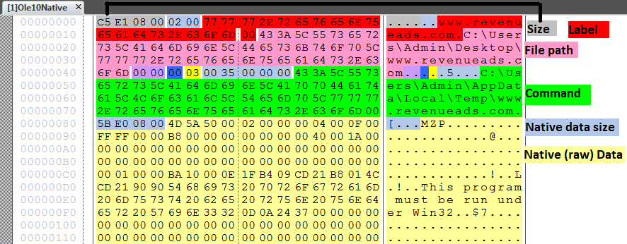

## Exploring OLE10Native within malicious Microsoft Word Documents. 

In the past year embedding executable code within Word documents has become more prevalent. Microsoft wrote an excellent [article](https://blogs.technet.microsoft.com/mmpc/2016/06/14/wheres-the-macro-malware-author-are-now-using-ole-embedding-to-deliver-malicious-files/) about the rise of this technique back in June 2016. Microsoft mentions some technical details of the payload but didn't dive into how the objects were embedded. Recently while coding  a carver for embedded OLE10Native objects, I came across some artifacts that I thought were interesting.

Native data stored in a Microsoft Office document is stored in a stream object named `\1Ole10Native`. The stored data which could be a Visual Basic Script (.VBS), executable (.exe) or a .LNK file are known as [embedded objects](https://msdn.microsoft.com/en-us/library/windows/desktop/ms679749(v=vs.85).aspx).  I'd like to note that there are many different type of embedded objects and streams. `\1Ole10Native` is just one type used to store native data that was copied and pasted or dragged and dropped into a document.  Extracting OLE10Native objects within Word documents can be done with the following steps. 

 1. The documents needs to be unzipped.
 2. The OLE Compound File Binary Format needs to be read.
 3. The embedded objects needs to be extracted.

During my analysis, all of the samples I found were Microsoft Word documents in the [Office Open XML format](https://en.wikipedia.org/wiki/Office_Open_XML).  This file format is compressed with zip and can be decompressed using Python's `zipfile`.  The OLE10Native stream will be within a folder named `embeddings`. The stream is within a file(s) named  oleObjectX.bin.  The X is an integer value that starts at 1 and increments based on how many embedded objects there are. Below is an unzipped document. 

```
    [Content_Types].xml
    customXml/
        item1.xml
        itemProps1.xml
        _rels/
            item1.xml.rels
    docProps/
        app.xml
        core.xml
    word/
        document.xml
        fontTable.xml
        settings.xml
        styles.xml
        stylesWithEffects.xml
        webSettings.xml
        embeddings/
            oleObject1.bin 
        media/
            image1.png
            image2.jpeg
        theme/
            theme1.xml
        _rels/
            document.xml.rels
    _rels/
        .rels
```

Within oleObject1.bin is the embedded object. Since this file is in the ole file format it will need to parsed using a tool such as [olefile](https://github.com/decalage2/olefile).  Within the ole stream is a record named `\x01Ole10Native`. This stream contains information about the embedded object along with the embedded stream. The following figure is a hexdump with notable fields labeled.  The field names are not the correct Microsoft labels. I was unable to find these fields documented. 




The fields `label`, `file path` and `command` are unique because when analyzing malicious documents it is not very common to recover details about the host or even command names being. To extract the native data and fields I wrote a script named `oleNativeCarve.py`.  As of right now, it can be executed by double clicking on it or you can call `carve_ole_native(file_path, debug=False`. The first argument is the file path and the second argument is optional, which prints some basic debug information. The script saves all carved files to the working directory. The carved files will have a naming convention of `SHA256.bin`.  Details about the carved file will be stored in a file named `SHA256.json`. Below is the output from an example JSON. 

```
{"native_data_size": 581723, "parent_sha256": "e635400d56049f8ee3f26e372f87c90816c48f73d114cab1bef78a5ed2a1df3a", "flags1": 2, "flags2": 0, "unknown": 0, "label": "www.revenueads.com", "unknown2": 3, "unknown3": null, "command": "C:\\Users\\Admin\\AppData\\Local\\Temp\\www.revenueads.com", "sha256": "c5d19edc4187c936682e5ab45a2cb99724d447a1d68f914fce5ccfdd25c8e53f", "file_path": "C:\\Users\\Admin\\Desktop\\www.revenueads.com", "size": 582085}
```

The parent file that contained the `\x01Ole10Native` stream has a hash of `e635400d56049f8ee3f26e372f87c90816c48f73d114cab1bef78a5ed2a1df3a`. The native data within the stream has a hash of `c5d19edc4187c936682e5ab45a2cb99724d447a1d68f914fce5ccfdd25c8e53f`. The stream was saved to a file named `c5d19edc4187c936682e5ab45a2cb99724d447a1d68f914fce5ccfdd25c8e53f.bin` and the JSON data was stored in a file named `c5d19edc4187c936682e5ab45a2cb99724d447a1d68f914fce5ccfdd25c8e53f.json`. The field `sha256` is the hash of the carved file, `parent_sha256` is the hash of the parent file that the binary and json were extracted from.  Below is the full code for the `oleNativeCarve.py`.

```
ADD CODE. 
```
Each document with an `\x01Ole10Native` stream contains little details. These details could be file types, mounted drives, folder structures and even commands. This might seem useless but it hints at how the attackers work and their infrastructure. It isn't actionable intelligence but it still interesting.  In order to explore this topic I downloaded close to 2000 samples from VirusTotal that matched a custom search. I then ran `oleNativeCarve.py` in the directory that I downloaded the samples to. `oleNativeCarve.py` was able to carve out 871 files. Now lets explore those details extracted from the `\x01Ole10Native` stream.

#### File Types 
Below are the most common files extensions sorted from highest to lowest. 
```
'scr': 223, 'js': 206, 'lnk': 116, 'jar': 79, 'exe': 79, 'vbs': 57, 'JAR': 34, 'zip': 11, 'cab': 7, 'pdf': 5, 'bat': 5, 'com': 5, 'jse': 3, 'wsf': 3, '7z': 2, 'txt': 'vbe': 2, 'Tar': 1, 'ace': 1, 
```

#### File Names 
Below are the most common file names sorted from highest to lowest. Unique file names have been removed. 
```
'AdobeReaderPlugin.scr': 189, 'Unlock.js': 99, 'file.js': 86, 'Siparisler.jar': 76, 'SIPARISLER.JAR': 33, 'AdobeReader.scr': 33, 'Microsoft Silverlight Extension.vbs': 26, 'Microsoft-Dokument-Dekodierung.vbs': 5, 'Microsoft Word.exe': 4, 'Invoice No. 8234144-1': 3, 'Invoice No. 894244-1': 3, 'Decoder.vbs': 3, 'Zertifikat.js': 2, 'Receipt.pdf': 2, 'Rechnung Nr. 8002301-1': 2, 'siparisler.jar': 2, 'PROTECTED DOCUMENT NEEDS YOUR PERMISION TO VIEW  CLIK HERE TO VIEW DOC.exe': 2, 'Beleg Nr. 832777-99': 2, 'Dekodierung.vbs': 2, 'Faktur Nr. 08412': 2, 'i.exe': 2, 'Result.exe': 2
```
#### Mounted Drives and folders 
Below are the examples of different folder paths or mounted drives that the attackers used. 
```
\\Vboxsvr\REMOVED_UNICODE_\virus sample\3_4.exe C:\Users\ADMINI~1\AppData\Local\Temp\3_4.exe 3_4.exe
D:\software\Xlight\Xlight_SetUp.exe C:\Users\fmanik\AppData\Local\Temp\Xlight_SetUp.exe Xlight_SetUp.exe
D:\userdata\e0368301\Desktop\debug\LogCollection\Official\SampleOutputMemLeak.log C:\Users\e0368301\AppData\Local\Temp\SampleOutputMemLeak.log SampleOutputMemLeak.log
D:\userdata\e0368301\Desktop\debug\LogCollection\Official\tools.zip C:\Users\e0368301\AppData\Local\Temp\tools.zip tools.zip
D:\userdata\e0368301\Desktop\T_Trs_Client.zip C:\Users\e0368301\AppData\Local\Temp\T_Trs_Client.zip T_Trs_Client.zip
D:\REMOVED_UNICODE_\SkymonkUploader.exe C:\Users\Stranger\AppData\Local\Temp\SkymonkUploader.exe SkymonkUploader.exe
E:\3d\Result.exe C:\Users\Art\AppData\Local\Temp\Result.exe Result.exe
E:\TEMP\G\01.11.16\httpchallengegx.topvaginapussysso5sok.php\Invoice 9840018.lnk C:\Users\azaz\AppData\Local\Temp\Invoice 9840018.lnk Invoice 9840018
E:\TEMP\office\de\turpentinet\Faktur Nr. 08412.lnk C:\Users\Office\AppData\Local\Temp\Faktur Nr. 08412.lnk Faktur Nr. 08412
F:\2.wsf C:\Users\admin\AppData\Local\Temp\2.wsf 2.wsf
F:\_Kit\foliant\106\AdobeReaderPlugin.scr c:\Temp\AdobeReaderPlugin.scr AdobeReaderPlugin.scr
F:\_Kit\temp\13\AdobeReader.scr c:\Temp\AdobeReader.scr AdobeReader.scr
F:\_Kit\temp\6\AdobeReader.scr c:\Temp\AdobeReader.scr AdobeReader.scr
F:\EFT (8).js C:\Users\admin\AppData\Local\Temp\EFT (8).js EFT (8).js
F:\Formacion\PowerShell\Consola sin Privielgios\GrabberBanner.ps1 C:\Users\darnaiz\AppData\Local\Temp\GrabberBanner.ps1 GrabberBanner.ps1
F:\Formacion\PowerShell\telnet.exe C:\Users\darnaiz\AppData\Local\Temp\telnet.exe telnet.exe
H:\_doc\udp\11\AdobeReader.scr c:\Temp\AdobeReader.scr AdobeReader.scr
H:\WINDOWS\system32\cmd.exe H:\WINDOWS\system32\cmd.exe Cmd.exe
H:\REMOVED_UNICODE_\Downloads\REMOVED_UNICODE_\H_SERV 23.12.16\REMOVED_UNICODE_\Steam Checker.exe C:\Users\4DD5~1\AppData\Local\Temp\Steam Checker.exe Steam Checker.exe
J:\projects\email_spam\payload\MailChimpTests\018257.docx.js C:\Users\Lenovo\AppData\Local\Temp\018257.docx.js 018257.docx.js
P:\PRJDATA\TROJAN\0de9c5c6599fdf5201599ff9b30e0000\RELEASE142\baweb.autocompl?fdp.exe C:\Users\DVD\AppData\Local\Temp\baweb.autocompl?fdp.exe baweb.autocompl?fdp.exe
W:\_kitchen\foliant\9\AdobeReaderPlugin.scr C:\Temp\AdobeReaderPlugin.scr AdobeReaderPlugin.scr
W:\_kitchen\upd\100\AdobeReaderPlugin.scr C:\Temp\AdobeReaderPlugin.scr AdobeReaderPlugin.scr
X:\rayban\uniqo\12\AdobeReaderPlugin.scr C:\Temp\AdobeReaderPlugin.scr AdobeReaderPlugin.scr
X:\Tasks\DUK\Image_Release_20160422\SOP\Tools\CDM21216_Setup.exe C:\Users\renic.lin\AppData\Local\Temp\CDM21216_Setup.exe CDM21216_Setup.exe
X:\Tasks\DUK\Image_Release_20160422\SOP\Tools\Tftpd32-3.51-setup.exe C:\Users\renic.lin\AppData\Local\Temp\Tftpd32-3.51-setup.exe Tftpd32-3.51-setup.exe
Z:\home\localhost\www\jse\1485971059-854.js C:\Users\my\AppData\Local\Temp\1485971059-854.js 1485971059-854.js
Z:\js loader\REMOVED_UNICODE_\invoice 26.01.2017\invoice 26.01.2017.js C:\Users\my\AppData\Local\Temp\invoice 26.01.2017.js invoice 26.01.2017.js
Z:\Users\calvinfong\Desktop\Spam & Virus\eicar.com Z:\Users\CALVIN~1\AppData\Local\Temp\eicar.com eicar.com
```
For the `file_path` field 595 used the C drive and 275 used a mounted or network drive. 

#### Campaigns
As demonstrated in the file types and file names section above the Adobe `.scr` files were the most common. They use mounted drives, a folder depth of three and the child folder using an integer as the name. The folder names are likely affiliates ids. All of the `.scr` files have unique hashes. 
```
F:\_Kit\foliant\11\AdobeReaderPlugin.scr 
F:\_Kit\foliant\134\AdobeReaderPlugin.scr 
F:\_Kit\foliant\476\AdobeReaderPlugin.scr 
F:\_Kit\foliant\54\AdobeReaderPlugin.scr 
H:\_doc\udp\13\AdobeReader.scr 
H:\_doc\udp\6\AdobeReader.scr 
H:\_doc\udp\8\AdobeReader.scr
W:\_kitchen\foliant\9\AdobeReaderPlugin.scr 
W:\_kitchen\upd\2\AdobeReaderPlugin.scr 
W:\_kitchen\upd\43\AdobeReaderPlugin.scr 
W:\_kitchen\upd\87\AdobeReaderPlugin.scr 
W:\_kitchen\upd\88\AdobeReaderPlugin.scr 
X:\rayban\uniqo\22\AdobeReaderPlugin.scr 
X:\rayban\uniqo\32\AdobeReaderPlugin.scr 
X:\rayban\uniqo\78\AdobeReaderPlugin.scr 
X:\rayban\uniqo\88\AdobeReaderPlugin.scr 
X:\rayban\uniqo\89\AdobeReaderPlugin.scr 
``` 
All of `command` fields contain the same path  of `c:\Temp\AdobeReaderPlugin.scr` except for `F:\_Kit\foliant\54\AdobeReaderPlugin.scr`  It's `command` path is  `C:\Users\VASILE~1\AppData\Local\Temp\AdobeReaderPlugin`. 

The last campaign is by far my favorite find. It appears to be a part of Dridex's distribution. The attackers use a mounted drive with a structure of `E:\TEMP\G\Day.Month.Year\country\campaign\payload`.  The `country` folder is not present through out the folder paths. The targeted country codes are `en` (Estonia), `ch` (Switzerland) and `UK` (United Kingdom) and `de` (Germany). Here is the full list of paths I was able to recover. 
 
```
E:\TEMP\G\28.10.16\en\httphts-ag.topdedbombomplus100500.php\Invoice No. 8234144-1.lnk
E:\TEMP\G\18.11.16\ch1\karas\Beleg Nr. 892234-35.lnk
E:\TEMP\G\21.11.16\http___iolavoro-e-iotiaiuto.ch_resellers_web_request-a-callback.php\Beleg Nr. 832777-99.LNK
E:\TEMP\G\20.10.16\CH\httpbestell.bigatronic.comcardservicesswissquoteviseca.php\Dekodierung.vbs
E:\TEMP\G\28.10.16\en\httpwysshaar.topdedbombomplus100500.php\Invoice No. 8234144-1.lnk
E:\TEMP\G\21.10.16\httpsupport.searchindianschools.comsquirrelmailaccountjunk.php\Decoder.vbs
E:\TEMP\G\28.10.16\en\httpschranzauto.topdedbombomplus100500.php\Invoice No. 8234144-1.lnk
E:\TEMP\G\27.10.16\en\httpbubatechgmbh.topEnglandPremierLeaguemanutd.php\Invoice No. 894244-1.lnk
E:\TEMP\G\22.11.16\http___travail-famille.ch_montravail_monaide_vaterschaftsurlaub.php\Beleg Nr. 4522374-19.lnk
E:\TEMP\G\27.10.16\en\httpsatisfactorykj.topEnglandPremierLeaguemanutd.php\Invoice No. 894244-1.lnk
E:\TEMP\G\20.10.16\CH\httpstar.bigatronic.chcardservicesswissquoteviseca.php\Dekodierung.vbs
E:\TEMP\G\18.10.16\UK\httpdjalab.caserealtygroup.comonlineaccountsbalances.php\Decoder.vbs
E:\TEMP\G\27.10.16\en\httpinspirationdz.topEnglandPremierLeaguemanutd.php\Invoice No. 894244-1.lnk
E:\TEMP\G\26.10.16_lnk\de\http57vinodpatel.topnazarethanimalslisten.php\Rechnung Nr. 261016-1.lnk
E:\TEMP\G\25.10.16\EN\httpgordonlevy.infofedappidp.php\Decoder.vbs
E:\TEMP\G\18.11.16\ch1\pelikan\Beleg Nr. 892234-31.lnk
E:\TEMP\G\10.11.16\ch\varietiesxl\Rechnung Nr. 8002301-1.lnk
E:\TEMP\G\10.11.16\uk\distributionde\Invoice 9010169.lnk
E:\TEMP\G\10.11.16\ch\meanwhiledm\Rechnung Nr. 8002301-1.lnk
E:\TEMP\G\01.11.16\httpchallengegx.topvaginapussysso5sok.php\Invoice 9840018.lnk
E:\TEMP\G\21.11.16\http___jetravaille-et-jetaide.ch_resellers_web_request-a-callback.php\Beleg Nr. 832777-99.LNK
```
The child folder appears to be named after the URL that is hosting the second stage. For example. the last path of `E:\TEMP\G\21.11.16\http___jetravaille-et-jetaide.ch_resellers_web_request-a-callback.php\Beleg Nr. 832777-99.LNK`This path is from a Word document named `Rechn. Nr. 2016.11. #18989.docx` with a SHA256 hash of `d9a294980d3e6950afac1bd7871bb40ad7c4172506ff1c996ad272c269831edf`. On  November 21st 2016 someone uploaded the file to [reverse.it](https://www.reverse.it/sample/d9a294980d3e6950afac1bd7871bb40ad7c4172506ff1c996ad272c269831edf?environmentId=100&lang=en). This is the same date as shown in the folder path `E:\TEMP\G\21.11.16`.  When the Word Documented is opened it will open an .LNK file which writes a PowerShell script that downloads an executable from `http://jetravaille-et-jetaide.ch/resellers/web/request-a-callback.php`. This URL is the name of folder that `Beleg Nr. 832777-99.LNK` is stored in.  The downloaded payload with a SHA256 hash of `adf616dd647f029e05726afc5ee5b11f90acbd9f72fcd1d8efed86c387fe390a` has been [identified](https://www.virustotal.com/en/file/adf616dd647f029e05726afc5ee5b11f90acbd9f72fcd1d8efed86c387fe390a/analysis/) as Dridex.